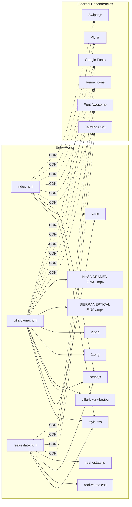
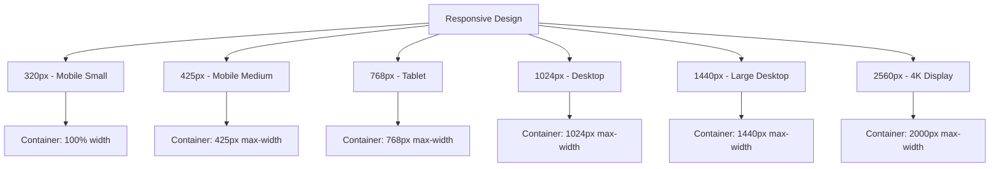

# Marketing-Atlas Project Structure Flowchart

```mermaid
graph TD
    %% Root Directory
    A[Marketing-Atlas/] --> B[.git/]
    A --> C[.vscode/]
    A --> D[home/]
    
    %% VS Code Configuration
    C --> C1[settings.json<br/>42B - Live Server Port 5501]
    
    %% Main Project Directory
    D --> E[HTML Files]
    D --> F[CSS Files]
    D --> G[JavaScript Files]
    D --> H[Media Files]
    
    %% HTML Files Structure
    E --> E1[index.html<br/>42KB, 948 lines<br/>Main Homepage]
    E --> E2[villa-owner.html<br/>57KB, 1265 lines<br/>Villa Owners Page]
    E --> E3[real-estate.html<br/>53KB, 1038 lines<br/>Real Estate Page]
    
    %% CSS Files Structure
    F --> F1[style.css<br/>24KB, 1283 lines<br/>Main Stylesheet]
    F --> F2[v.css<br/>4.8KB, 218 lines<br/>Video Styles]
    F --> F3[real-estate.css<br/>3.0KB, 159 lines<br/>Real Estate Styles]
    
    %% JavaScript Files Structure
    G --> G1[script.js<br/>17KB, 501 lines<br/>Main JavaScript]
    G --> G2[real-estate.js<br/>1.1KB, 36 lines<br/>Real Estate JS]
    
    %% Media Files Structure
    H --> H1[villa-luxury-bg.jpg<br/>399KB<br/>Background Image]
    H --> H2[1.png<br/>3.5MB<br/>Video Poster 1]
    H --> H3[2.png<br/>1.6MB<br/>Video Poster 2]
    H --> H4[SIERRA VERTICAL FINAL.mp4<br/>46MB<br/>Marketing Video 1]
    H --> H5[NYSA GRADED FINAL.mp4<br/>42MB<br/>Marketing Video 2]
    
    %% File Dependencies
    E1 -.->|imports| F1
    E1 -.->|imports| F2
    E1 -.->|imports| G1
    
    E2 -.->|imports| F1
    E2 -.->|imports| F2
    E2 -.->|imports| G1
    E2 -.->|uses| H1
    E2 -.->|uses| H2
    E2 -.->|uses| H3
    E2 -.->|uses| H4
    E2 -.->|uses| H5
    
    E3 -.->|imports| F1
    E3 -.->|imports| F3
    E3 -.->|imports| G1
    E3 -.->|imports| G2
    
    %% Technology Stack
    subgraph "Technology Stack"
        T1[Tailwind CSS 3.4.16]
        T2[Font Awesome 6.4.0]
        T3[Remix Icons 4.6.0]
        T4[Google Fonts]
        T5[Plyr.js 3.7.8]
        T6[Swiper.js 9]
        T7[Live Server]
    end
    
    %% External Dependencies
    E1 -.->|CDN| T1
    E1 -.->|CDN| T2
    E1 -.->|CDN| T3
    E1 -.->|CDN| T4
    E1 -.->|CDN| T5
    E1 -.->|CDN| T6
    
    E2 -.->|CDN| T1
    E2 -.->|CDN| T2
    E2 -.->|CDN| T3
    E2 -.->|CDN| T4
    E2 -.->|CDN| T5
    E2 -.->|CDN| T6
    
    E3 -.->|CDN| T1
    E3 -.->|CDN| T2
    E3 -.->|CDN| T3
    E3 -.->|CDN| T4
    
    %% Styling
    classDef htmlFile fill:#e1f5fe
    classDef cssFile fill:#f3e5f5
    classDef jsFile fill:#e8f5e8
    classDef mediaFile fill:#fff3e0
    classDef configFile fill:#fce4ec
    classDef techStack fill:#f1f8e9
    
    class E1,E2,E3 htmlFile
    class F1,F2,F3 cssFile
    class G1,G2 jsFile
    class H1,H2,H3,H4,H5 mediaFile
    class C1 configFile
    class T1,T2,T3,T4,T5,T6,T7 techStack
```



## 📊 File Storage Summary

### **Total Project Size: ~154MB**
- **Code Files:** ~148KB (0.1%)
- **Media Files:** ~154MB (99.9%)

### **File Distribution:**
```
📁 HTML Files (3 files) - 152KB
├── index.html: 42KB (27.6%)
├── villa-owner.html: 57KB (37.5%)
└── real-estate.html: 53KB (34.9%)

📁 CSS Files (3 files) - 31.8KB
├── style.css: 24KB (75.5%)
├── v.css: 4.8KB (15.1%)
└── real-estate.css: 3.0KB (9.4%)

📁 JavaScript Files (2 files) - 18.1KB
├── script.js: 17KB (93.9%)
└── real-estate.js: 1.1KB (6.1%)

📁 Media Files (5 files) - 154MB
├── SIERRA VERTICAL FINAL.mp4: 46MB (29.9%)
├── NYSA GRADED FINAL.mp4: 42MB (27.3%)
├── 1.png: 3.5MB (2.3%)
├── 2.png: 1.6MB (1.0%)
└── villa-luxury-bg.jpg: 399KB (0.3%)

📁 Configuration (1 file) - 42B
└── settings.json: 42B (100%)
```

## 🔗 File Dependencies Flow



## 🎯 Key Features by File

### **index.html** (Main Homepage)
- Hero section with background image
- Services overview
- Contact forms
- Mobile-responsive navigation
- WhatsApp integration

### **villa-owner.html** (Villa Owners Page)
- Dark theme with luxury styling
- Video carousel with Swiper.js
- Package pricing (Basic, Pro, Premium)
- One-time shoot pack
- Recent work showcase
- Contact section

### **real-estate.html** (Real Estate Page)
- Dark hero section
- Comprehensive services grid
- Marketing packages
- Contact forms
- Responsive design

### **style.css** (Main Stylesheet)
- Responsive grid system
- Animation keyframes
- Component styles
- Mobile-first approach
- Custom checkbox styling

### **v.css** (Video Styles)
- Video player customization
- Dark theme implementation
- Swiper carousel styling
- Fullscreen video handling

### **script.js** (Main JavaScript)
- Mobile menu functionality
- Form validation
- Modal system
- Smooth scrolling
- Animation triggers
- WhatsApp integration

## 📱 Responsive Breakpoints



This flowchart provides a comprehensive overview of the Marketing-Atlas project structure, showing file relationships, dependencies, and storage details for effective project management and development. 